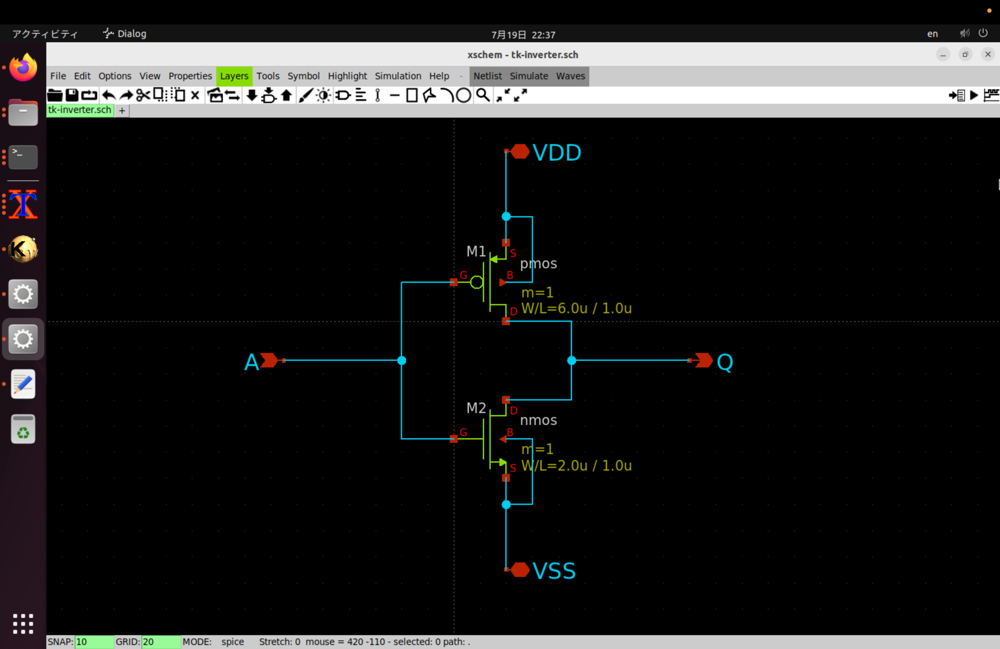
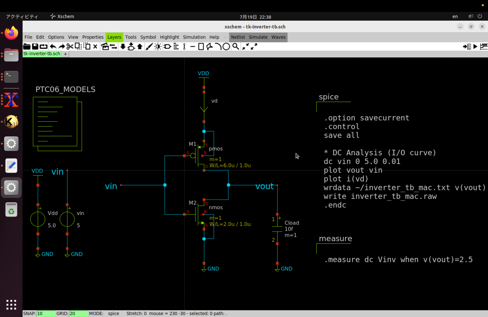
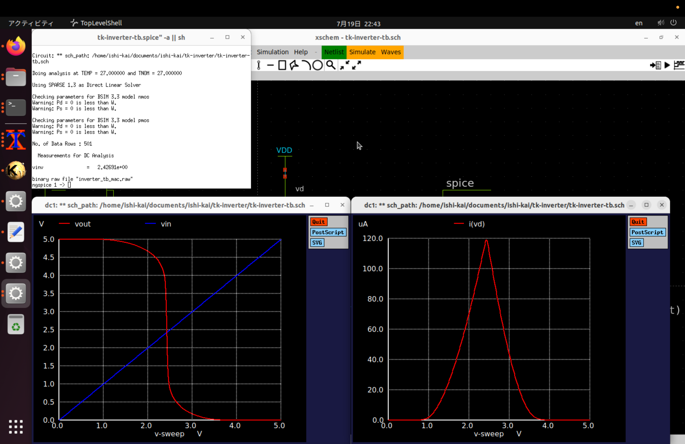
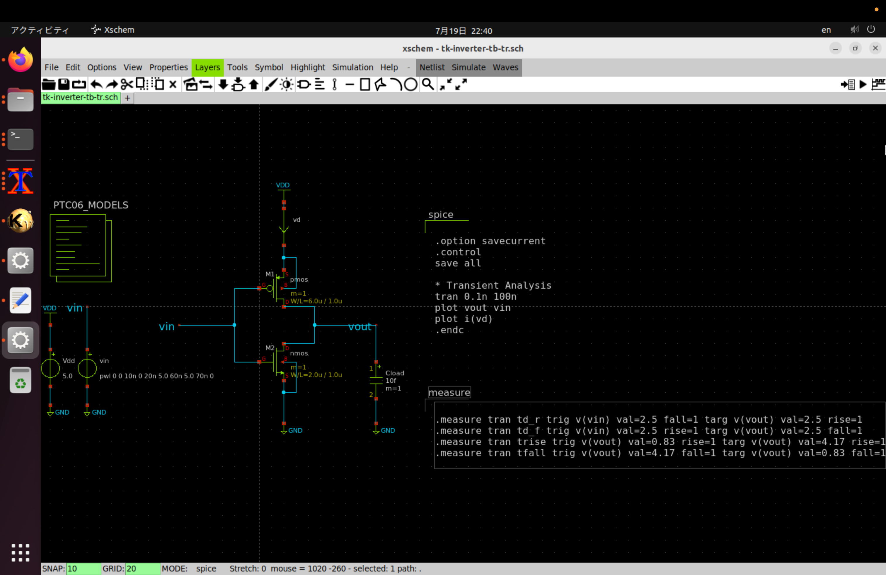
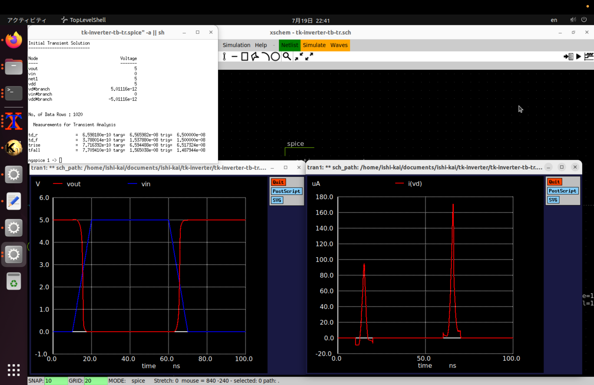

# 2025年07月イベント：初めての半導体設計・製造体験！一日で作るインバータ回路ハンズオン

## イベントページ
https://ishikai.connpass.com/event/356526/

## 提出物
 - [`tk-inverter.sch`](tk-inverter.sch) インバータの回路図 (xschemにて作成)
 - [`tk-inverter.gds`](tk-inverter.gds) チップのレイアウト (klayoutにて作成)

## 感想
その昔、とあるアーキテクチャの研究室で半導体設計は一瞬かすったのですが、今回、半導体のチップ製造までしていただけるとのことでまた勉強してみようと思い、参加させていただきました。
回路図を書いてシミュレーションするだけでなくレイアウトまで行うことで、物理レイヤへの理解がより深まりました。今後もさらに勉強したいと思います。
大変有意義なイベントを開催してくださりありがとうございました。

## スクリーンショット
- 回路(インバータ)

- DC解析 テストベンチ

- DC解析 シミュレーション結果

- トランジェント解析 テストベンチ

- トランジェント解析 シミュレーション結果

